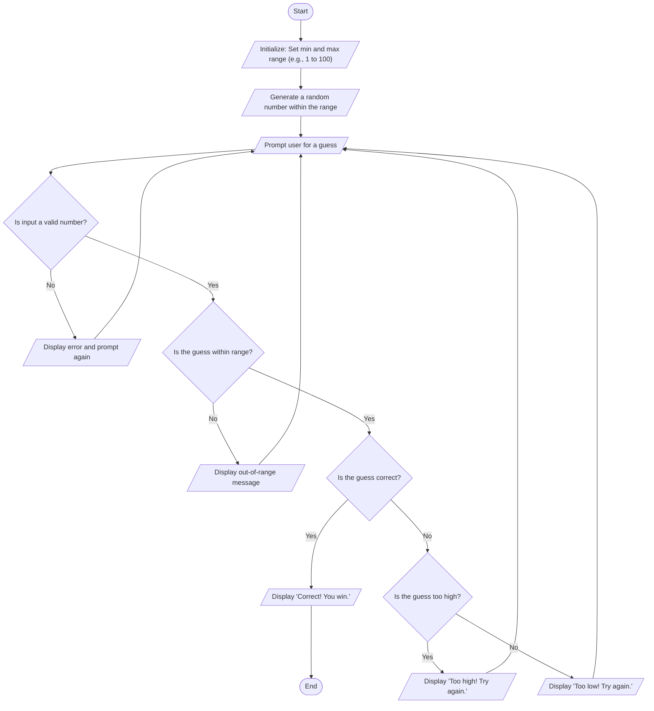

# -Guessing

* Start - The game begins.
* Initialize: Set min and max range – Set the minimum and maximum numbers the random value can be (1 to 100).
* Generate a random number within the range – The computer picks a hidden random number between the minimum and maximum.
* Prompt user for a guess - Ask the player to enter a number as their guess.
* Is input a valid number? – Check if the input is a number (not a letter or empty).
* If No: Show an error message and ask the player to guess again.
* If Yes: Move to the next check.
* Is the guess within range? – Check if the number is within the allowed range.
* If No: Show a message saying it's out of range and ask again.
* If Yes: Move to the comparison step.
* Is the guess correct? – Compare the player's guess to the target number.
* If Yes: Show “Correct! You win.” and end the game.
* If No: Check if the guess is too high or too low.
* Is the guess too high?
* If Yes: Show “Too high! Try again.” and return to ask for a new guess.
* If No (which means it's too low): Show “Too low! Try again.” and return to ask again.
